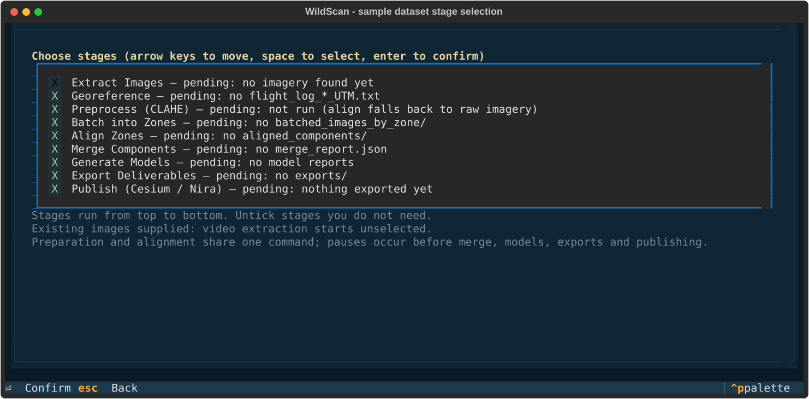

# wildscan — ROV Photogrammetry Pipeline for RealityScan 2.2

Processing pipeline for underwater ROV photogrammetry: extract and
georeference dive imagery, batch it, and drive **RealityScan 2.2**
(Epic Games, formerly RealityCapture) through its CLI to align images and
generate textured models.

Start with a dataset or an existing results folder. WildScan helps identify
available imagery and navigation files, review pipeline artifacts, and select
the next processing stages. RealityScan performs alignment and reconstruction;
WildScan prepares the inputs and runs the workflows around it.

**New users:** [install the checkout](docs/SETUP-AND-RUN.md), then follow
[Analyze a dataset](docs/ANALYZE_A_DATASET.md). Browse the
[documentation index](docs/README.md) for current instructions, developer
guidance, and dated experiment records.

The project is beta software for **native Windows 11** and RealityScan 2.2.
Offline regression tests cover planning, calculations, artifact detection,
and process supervision. They do not certify the reconstruction quality,
geographic accuracy, or native behavior of a new dataset or installation.

## Requirements

- Windows 10/11 (RealityScan is Windows-only; the data-prep scripts are
  Windows-oriented too)
- RealityScan 2.2 — the scripts auto-detect the executable under
  `C:\Program Files\Epic Games\RealityScan_2.2\` (and fall back to 2.1/2.0
  and `Capturing Reality` install folders). Override with the
  `RS_EXECUTABLE` environment variable or `"realityscan": {"executable": ...}`
  in `rs_settings.json`.
- **64-bit Python 3.13 or newer recommended** for development and native
  validation. The declared installation floor is 3.12: `numpy>=2.5` and
  `scipy>=1.18` require Python 3.12 or newer.
- One or more CUDA GPUs. RealityScan uses **all** GPUs by default; see
  [Multi-GPU](#multi-gpu) to pin instances to specific GPUs.

## Quickstart

New to the pipeline? [Setup and run](docs/SETUP-AND-RUN.md) is the full step-by-step
manual: prerequisites, environment, configuration, running a dive and
troubleshooting. The short version follows.

Every Python dependency is declared in `pyproject.toml`; installing the
project installs compatible versions at or above the declared minimums.
Prerequisites: [Git for Windows](https://git-scm.com/download/win) and
[64-bit Python](https://www.python.org/downloads/windows/) with the `py` launcher.

In **PowerShell** (the Windows default):

```powershell
git clone https://github.com/wild-technology/wildscan.git
cd wildscan
py -3.13 -m venv .venv
& ".\.venv\Scripts\python.exe" -m pip install --upgrade "pip>=26.2"
& ".\.venv\Scripts\python.exe" -m pip install -e ".[dev]"
```

Upgrade the environment installer before resolving dependencies. These
commands use the environment directly; activation and a PowerShell
execution-policy change are unnecessary. Run them from the checkout folder.
Select your installed version when creating the environment, for example
`py -3.14` for 3.14 or `py -3.12` for the package's minimum supported version.

Activation is optional: use `.\.venv\Scripts\Activate.ps1` in PowerShell or
`.venv\Scripts\activate.bat` in Command Prompt. Only after successful activation
can you shorten the examples to `python` or `wildscan`. A version-qualified
`py -3.13` launch uses the global interpreter even while an environment is active.

Verify the checkout before running anything against real data:

```powershell
& ".\.venv\Scripts\python.exe" -m pytest
```

Pytest collects the offline suite from `tests/` and reports the current test
count and skips. The geoid check skips when the EGM2008 grid is unavailable;
Windows-specific checks may skip elsewhere. Investigate failures before
processing data. These checks do not establish native RealityScan acceptance.

Then start the TUI, which is the product entry point:

```powershell
& ".\.venv\Scripts\python.exe" -m wildscan
```

`workspace` is the results folder for one dive (the pipeline writes
batches, aligned components, models and exports under it). It is optional:
without it, WildScan asks for the expedition, dive and folder during session
setup and remembers your answers for next time. To open an existing workspace,
append its quoted path, for example `"D:\survey results\dive_1"`. After activation,
`wildscan "D:\survey results\dive_1"` is equivalent; `python main.py` runs the
lower-level interactive module chain directly.

The install must be **editable** (`-e`): the TUI launches the driver scripts
(`main.py`, `merge_zones.py`, ...) and the `RS_CLI` workflows from the
checkout itself. Installing without the test suite is
`& ".\.venv\Scripts\python.exe" -m pip install -e .`. Use a Git clone:
the GitHub source ZIP does not apply Git's CRLF rules to native workflows.
Wheels and packaged source archives omit root drivers and other checkout files
needed by the full pipeline.
The `tui` extra is retained for compatibility and installs the
same processing dependencies as the base project. `requirements.txt` is kept in
step with `pyproject.toml` for anyone who prefers
`& ".\.venv\Scripts\python.exe" -m pip install -r requirements.txt`; that route
installs no `wildscan` command, so start the TUI with the environment interpreter's
`-m wildscan` from the checkout folder.

> RealityScan itself is a separate Windows install from Epic Games and is not
> a pip dependency. Nira publishing additionally needs the `niraclient`
> checkout (Enterprise plan), configured with its API key and secret and pointed
> at by `NIRACLIENT_DIR` — see [Nira setup](docs/SETUP-AND-RUN.md#56-nira-publishing).
> Cesium publishing converts depths to ellipsoidal heights through the EGM2008
> geoid grid (~80 MB). PROJ can fetch grid data from cdn.proj.org when network
> access works; install the complete grid for offline use as described in
> [geoid setup](docs/SETUP-AND-RUN.md#55-cesium-publishing-the-geoid-grid).
>
> Before importing flight logs, install the custom format from the repository's
> `flightlogs.xml` into the RealityScan installation dictionary, preserving
> its existing formats. Follow [the setup guide](docs/SETUP-AND-RUN.md#54-flight-log-import-format).

Extraction accepts `.mp4` and `.mov` recordings with a UTC timestamp in the
filename. OpenCV supplies the decoder; a separate `ffmpeg.exe` is unnecessary.
Check the [video and navigation formats](docs/SETUP-AND-RUN.md#your-data) before
preparing a dive.

## Analyze a dataset

1. Open WildScan and identify the expedition and dive.
2. Point it at a delivered cruise folder, a folder of still images, or a
   specific video. Add processed navigation data when available, and choose
   a separate results folder.
3. Review the detected files and workspace stage status. A filename match or
   existing artifact is a useful starting point; it does not establish that
   a video decodes, navigation covers the imagery, or a mesh is accurate.
4. Select the stages needed for this dataset, check every parameter, and
   review the plan before choosing **Run**.

For an existing results folder, choose **View results** to inspect its
pipeline and component tables without starting a processing run.



The screenshot shows the actual interface with a labelled sample of 24 still
images and one navigation CSV. No native processing has run.

Use the [dataset guide](docs/ANALYZE_A_DATASET.md) for the input checklist,
stage meanings, results layout, and inspection limits. Publishing is optional
and needs credentials for the destinations you select. Alignment writes XMP
sidecars into its image input tree; preserve originals and run it against
working copies or the pipeline's prepared zone tree.

## Documentation

| I want to… | Read |
|---|---|
| Install on a new Windows machine | [Setup and run](docs/SETUP-AND-RUN.md) |
| Understand a new dataset or resume a workspace | [Analyze a dataset](docs/ANALYZE_A_DATASET.md) |
| Understand the code and native execution rules | [Architecture](ARCHITECTURE.md) |
| Look up a RealityScan command, setting, or failure mode | [RealityScan reference](docs/rs-reference/README.md) |
| Read past experiments and product decisions | [Historical records](docs/README.md#historical-records) |

## Repository layout

| Path | Purpose |
|---|---|
| `main.py` | Interactive orchestrator: Extract Images → Georeference → Preprocess Images → Batch Directory → RealityScan Alignment (per-zone `AlignZone.bat`; `RS_MODULES`/`RS_NO_INTERACTIVE` env vars for non-interactive runs; a failed module stops the chain) |
| `wildscan/` | WildScan, the interactive TUI portal over the whole pipeline (`wildscan [workspace]`): session setup, resume-aware stage picking, parameter wizard, live run screen, pipeline census + final-components browser — always launching stages through the canonical drivers |
| `merge_zones.py` | Iterative component-merge driver: imports every per-zone component into a fresh scene and escalates mechanism/flags (georef merge → align+rematch → +High overlap) until the registration target is met; writes `merge_report.json` |
| `grow_zone.py` | Within-zone component growth driver: on a zone's ORIGINAL aligned scene, checkpointed global re-align → rigid `-mergeComponents` → per-component grow passes, each accepted or rolled back on the never-shrink invariant; writes `grow_report.json` |
| `run_models.py` | Models every final component of a workspace's assembly via `GenerateModel.bat`, scale-gated (metric-scale oracle per component) and smallest-first; resumable via `models_report.json` |
| `publish_batch.py` | Publishes every exported component (`exports/<comp>/obj`) to Cesium ion and/or Nira — whichever credentials are present — by driving the two publishers below; writes `publish_report.json` |
| `publish_cesium.py` | Uploads one mesh export (OBJ) to Cesium ion as a tiled 3D asset via ion's REST flow — the scripted equivalent of the GUI-only "Share to Cesium ion" button |
| `publish_nira.py` | Uploads one export to Nira through the official `niraclient` (Enterprise plan required), building the explicit typed file list Nira's docs recommend |
| `modules/camera_registry.py` | Single source of truth for the four physical rig cameras (lens, calibration groups, XMP content, filename families) |
| `georeference_survey.py` | Standalone georeferencing (ROV nav CSV → RealityScan flight logs), including multiprocessing image copying. |
| `poses_to_flight_log.py` | Post-alignment: rewrite camera locations back to UTM from the computed poses (XMP sidecars), producing a refined flight log + per-image nav-error QC |
| `decimate_images.py` | Copy a percentage of images to a new folder (dataset thinning) |
| `timestamp_rename.py` | Rename `cam*_TIMESTAMP.jpg` → `TIMESTAMP_cam*.jpg` and validate JPEG integrity (was the misnamed `masking.py` — it never masked; renamed 2026-08-07) |
| `organize_by_date.py` | Sort images into per-date subfolders (was `test.py`) |
| `module_base/` | Framework: `RSModule` base class, `Parameter`, `SettingsStore` |
| `modules/realityscan_interface/` | Everything that talks to RealityScan — see below |
| `modules/extract_images/`, `modules/georeference/`, `modules/preprocess_images/`, `modules/image_batcher/` | Pipeline modules used by `main.py` |
| `tests/` | Offline pytest regression tests and fixtures |
| `scripts/campaigns/` | Dataset-specific ON2026 drivers, the calibration ladder, and the overnight workbench campaign |
| `scripts/validation/` | Explicit manual checks: zone_9 native validation, preprocessing checks, and the Cesium depth probe |
| `scripts/analysis/score_yellow_pixels.py` | Image analysis for yellow-pixel contamination; writes scores without changing images |
| `docs/validation/`, `docs/validation/results/` | Dated experiment plans and preserved result evidence |
| `flightlogs.xml`, `sensorsdb.xml` | RealityScan reference data |
| `docs/code-review-2026-07.md` | What the first-machine validation changed and why (read before trusting older assumptions about the CLI layer) |

The canonical utility names are `georeference_survey.py`, `decimate_images.py`,
and `poses_to_flight_log.py`. The former names `geoall.py`, `decimator.py`, and
`poses2flightlog.py` remain command and import aliases. Existing settings
sections keep those old keys, so saved answers continue to work.

Manual validation is separate from pytest. For a small preprocessing check
on copies of your images, use:

```powershell
& ".\.venv\Scripts\python.exe" scripts/validation/check_preprocessing.py --dataset "D:\survey\images" --work-dir "D:\survey_preprocess_check"
```

The supplied work directory must be empty and separate from the source;
omitting it uses a temporary directory. The native zone_9 runner is
`scripts/validation/run_zone9_validation.bat` (or the adjacent `.py` file).
It runs RealityScan alignment; `probe_cesium_depth.py` creates a real Cesium
probe asset. Campaign drivers live under `scripts/campaigns/` and retain their
campaign-specific paths and settings.

Retired scripts are excluded from the published tree. Their
[original archive snapshot](https://github.com/wild-technology/wildscan/tree/0401a5a04097cba149989f7e8c60e57c09c1c549/archive)
remains available for historical citations; a local `archive/` is ignored.
The dated plans in `docs/validation/` retain the filenames and commands used
when those experiments were recorded. Current commands use the layout above.

### Preprocessing default

`Preprocess Images` applies CLAHE (clip 2.0, 8×8 tiles, L channel in LAB)
to copies under `<output>/preprocessed_images`, leaving the originals in
place. The current workflow uses those processed copies for both alignment
and texturing. The default was A/B-measured on a zone_9 400-image subset (2026-07-21,
`scripts/validation/run_zone9_validation.py`): baseline registered 0% (no component at
all), CLAHE 2.0/8×8 registered 59.8% and beat every neighboring clip/tile
setting; gray-world white balance *reduced* registration (~34%) and is
off by default.

### Known duplication

`georeference_survey.py` (standalone) and `modules/georeference/georeference_images.py`
(pipeline module) implement the same georeferencing workflow. The standalone
uses multiprocessing for image copying; the module is wired into `main.py`.
Both share the camera and mount registries, and regression tests check their
orientation and offset calculations agree. Use `georeference_survey.py` for
standalone runs and keep the shared behavior consistent when either workflow
changes.

## Persisted settings (`rs_settings.json`)

All standalone scripts and `main.py` prompts remember your last answers.
Values are stored in `rs_settings.json` at the repo root (gitignored,
human-editable) via `module_base/settings_store.py`, and offered as the
default on the next run — press Enter to reuse them.

Reserved section `"realityscan"`:

```json
{
  "realityscan": {
    "executable": "C:\\Program Files\\Epic Games\\RealityScan_2.2\\RealityScan.exe",
    "instance_name": "RS1",
    "gpu_devices": "0,1"
  }
}
```

All keys are optional; omit the file entirely for auto-detection and
defaults.

## RealityScan execution

RealityScan workflows use a shared execution layer —
`modules/realityscan_interface/realityscan_cli.py` on the Python side and
the shared `:run` pattern in the `RS_CLI/Scripts/*.bat` workflow scripts.
Developer rules for this layer are in [Architecture](ARCHITECTURE.md) and
[Contributing](CONTRIBUTING.md).

Execution follows these rules:

1. `startRealityScan.bat` boots one persistent instance named
   `RS1` (`-setInstanceName`), or attaches to it with a fresh scene if it
   already exists, and waits for readiness by polling `-getStatus` (bounded
   at 120 s). Python drivers default to a visible instance; set
   `RS_HEADLESS=1` or `realityscan.headless=true` for headless operation.
   Hand-run batch workflows default to headless when that variable is absent.
2. The instance is started with RealityScan's built-in monitoring hooks
   (all marker files are namespaced per instance so parallel instances
   stay isolated):
   - `-writeProgress Errors\progress_<instance>.txt 600` — progress
     stream, tailed live by `RealityScanCLI` for logging and stall
     warnings;
   - `appProcessAction=ExecuteProgram` + `appProcessExecCmd` →
     `Errors\ErrorWriter.bat` — RealityScan itself reports every finished
     process (`$(processResult)`, `$(processId)`, `$(processDuration)`).
     Completions append to `results_<instance>.log`; failures (result
     codes other than 0/1) append to `errors_<instance>.txt`;
   - `-silent <Errors dir>` so crash dialogs can never hang an unattended
     run (a crash exits with code 3 and a minidump instead).
3. Workflow scripts execute every operation through the `:run` subroutine:
   `-delegateTo <instance> <cmd>` → grace delay → `-waitCompleted` twice
   with a second grace between them (`-waitCompleted` alone can return
   prematurely before the instance picks the queued command up) → abort
   the workflow if `errors_<instance>.txt` is non-empty. Do NOT gate on
   `results_<instance>.log` growth: RealityScan 2.2 emits heartbeat
   processes through the same trigger, so "the log grew" does not mean
   "our command finished" (that check raced ahead of a running `-align`
   and was removed). The results log is history/diagnostics; the errors
   marker is the abort trigger. One command per delegation, always.
4. `RealityScanCLI.run_batch_script()` wraps the whole workflow:
   - a per-instance **lock file** (with PID liveness check) prevents two
     orchestrators from driving the same instance name concurrently;
   - a leftover instance from an interrupted run is shut down (never
     silently attached to) before the workflow starts;
   - marker files are cleared before each run so stale state can never be
     misread, and read back only **after** verified shutdown so a failure
     in the final save can never be missed;
   - **no overall timeout** — alignment/reconstruction on large datasets
     legitimately runs 10+ hours; a stall only logs a warning after 2 h of
     silence;
   - after the workflow ends, the instance is verified to have actually
     shut down via `-getStatus` before the next run may start, so
     consecutive runs can never share a scene.
5. Completion is never inferred from process names. (Historical bug: the
   old code polled `tasklist` for `RealityCapture.exe` after the executable
   had been renamed `RealityScan.exe`, so the wait always returned
   immediately and raced ahead of the CLI.)
6. **Boot mode refuses `*` as an instance name.** `*` means "first
   available instance" and a GUI/Epic-Launcher RealityScan answers it —
   so booting against it would `-quit` and then `-newScene
   -deleteAutosave` somebody's live interactive scene. Only *attach* mode
   (`finish_model.py` / `run_attach_script`) accepts `*`; it never boots
   and never resets.
7. **Workflow arguments are validated before they reach `cmd`.** Python's
   `list2cmdline` quotes only on whitespace and `cmd` re-parses even a
   quoted argument, so `& ^ | < > ( ) = , ; % ! " ` ` in a path are
   silently split, eaten, or *executed* — with the process still
   returning 0. `RealityScanCLI` raises a `ValueError` naming the
   argument instead. If an expedition folder is called `NA167, dive 2` or
   `Wreck & Debris`, rename it or pass the value through a file/env var
   (hard rule 8).

### The input image folder is WRITTEN INTO

Alignment does not treat the folder you hand it as read-only, and this
matters when you point the pipeline at your own imagery rather than a
pipeline-made zone tree:

- the in-session identity harvest **MOVES** every pose-bearing `.xmp`
  sidecar out of the tree into `<output>/identity_r<K>` and does not put
  it back (leftover pose sidecars auto-import as exact-pose priors on any
  later add — bug B7);
- remaining sidecars are **rewritten** to calibration-only content, or
  **deleted** when the filename matches no known camera;
- missing calibration sidecars are **regenerated** for recognised
  cameras.

A run whose input folder already contains pose sidecars logs a loud
warning naming the count before anything moves. Copy the folder first if
those sidecars are yours.

### Multi-GPU

RealityScan uses every CUDA GPU by default (`sfmGPUAcceleration=true` in
`Metadata/AlignmentParams.xml`) — a single instance already benefits from
the multi-GPU machine with no configuration.

To run **parallel instances pinned to specific GPUs** (e.g. two zones at
once), give each its own instance name and GPU set:

- Python: `RealityScanCLI(logger, instance_name="RS_GPU0")` and
  `run_batch_script(..., gpu_devices="0")`, or set `instance_name` /
  `gpu_devices` in `rs_settings.json`;
- Batch: set `RS_INSTANCE=RS_GPU0` and `RS_GPU_DEVICES=0` before calling a
  workflow script (`RS_GPU_DEVICES` is exported as `CUDA_VISIBLE_DEVICES`
  for the launched instance).

The per-instance lock makes concurrent same-instance runs fail fast instead
of corrupting each other.

## Lessons learned

Collected from prior iterations of this repo (some of which only survive in
git history — see `git log`):

- **Delegation pickup race**: use the delegation and completion checks
  described in [RealityScan execution](#realityscan-execution).
- **No operation timeouts**: 10+ hour alignments are normal on these
  datasets. Startup and shutdown verification are bounded; the defaults live
  in `modules/realityscan_interface/realityscan_cli.py` and can be overridden in settings.
- **Never detect completion by process name** — see the
  `RealityCapture.exe`/`RealityScan.exe` bug above.
- **Suppress dialogs for unattended runs**: `-silent` + `appAutoSaveMode=false`;
  a modal dialog on a headless box hangs the pipeline forever.
- **`-set` keys changed with the RealityScan rename**: the app settings are
  `appQuitOnError`, `appProcessAction`, `appProcessExecCmd`,
  `appProcessActionTime` — the legacy `RealityCapture*` key names the old
  scripts used are not valid in 2.x.
- **Network drives are slow for RealityScan file operations** — export to a
  local disk first, then copy to network storage.
- **One instance, one orchestrator** — enforced by the lock file.

## Typical workflows

**WildScan** is the interactive console over the whole pipeline. It reviews
the artifacts in a results folder, offers stages according to their status,
collects parameters, and launches the canonical drivers. During a run it
streams logs and progress; workspace status summarizes recorded component
scales, models, and exports. See the [dataset guide](docs/ANALYZE_A_DATASET.md)
for what those records establish and what still needs inspection.

```powershell
& ".\.venv\Scripts\python.exe" -m wildscan "F:/na156_h2024_v2"
```

Deliverable export (OBJ by parts per Nira guidance, FBX by parts, ultra-dense
colored PLY) and publishing:

```powershell
& ".\.venv\Scripts\python.exe" modules/export_deliverables.py --project "D:\dive\merged\assembly\Merged.rsproj" --exports "D:\dive\exports" --names "D:\dive\exports\components.names"
& ".\.venv\Scripts\python.exe" publish_cesium.py --name "IN-401 hull" --dir "D:\dive\exports\COMPONENT\obj" --verify
& ".\.venv\Scripts\python.exe" publish_nira.py --name "IN-401 hull" --dir "D:\dive\exports\COMPONENT\obj" --niraclient "C:/tools/niraclient"
```

(Cesium ion and Nira both recommend the OBJ; Nira scripted upload needs an
Enterprise-plan API key, and Nira does not accept PLY point clouds — LAS/
LAZ/E57 only.)

Full interactive pipeline (extraction through per-zone alignment):

```powershell
& ".\.venv\Scripts\python.exe" main.py
```

Merge the per-zone components, then build the model on the merged result:

```powershell
& ".\.venv\Scripts\python.exe" merge_zones.py --components_root "D:\dive\aligned_components" --images_root "D:\dive\batched_images_by_zone" --output "D:\dive\merged"
& ".\.venv\Scripts\python.exe" run_models.py --workspace "D:\dive"
```

Export the modelled assembly through `modules/export_deliverables.py` with a
component-name list derived from `merged/merge_report.json`. The
[command-line setup instructions](docs/SETUP-AND-RUN.md#63-the-stages-on-the-command-line)
show how to create that list and run the export driver.

### Finishing a model in a running instance

`ModelToFinal.bat` takes an **already-computed** mesh through the model
back half on its own — texture → (optional simplify) → unwrap →
reproject → export → save — against a scene open in a **running**
instance (e.g. a reconstruction computed interactively in the GUI). It
never calculates a mesh and never creates a scene. Canonical example
(from `modules\realityscan_interface\RS_CLI\Scripts`):

```
ModelToFinal.bat "*" "<outdir>" <name> 4x8k true objmetric false false
```

Arguments: target instance (`*` = "first available" — the way to reach a
GUI-launched instance, which answers no named lookup), export directory,
model name, texture preset (`4x8k` = the default 8K cap), simplify
true/false, export format (`objmetric` exports the same OBJ as `obj` but
at **true scale 1.0** instead of the stock preset's Unreal-oriented
scale 100), cull polygons, correct colors. Set the `RS_SAVE_PATH`
environment variable to save the finished project to an explicit path
(bare `-save` writes back to the project's original location, which a
scene built interactively and never saved does not have).

Safety property: this workflow **attaches** to the running instance and
deliberately never calls `startRealityScan.bat` — that script issues
`-newScene -deleteAutosave` when it finds an instance already running,
which would destroy the very scene this workflow exists to finish.

Standalone zone alignment (from `modules/realityscan_interface/RS_CLI/Scripts`):

```
AlignZone.bat "D:\zones\zone_01" "D:\dive\aligned_components\zone_01" "D:\zones\zone_01\flight_log_4Q_UTM.txt" "..\Metadata\FlightLogParams.xml" zone_01 50
```

Standalone georeferencing:

```powershell
& ".\.venv\Scripts\python.exe" georeference_survey.py
```

All prompts default to your previous answers (see `rs_settings.json`).
Set `RS_HEADLESS=0` to boot the RealityScan instance with its GUI
visible; alignment settings always come from
`modules/realityscan_interface/RS_CLI/Metadata/AlignmentParams.xml`,
never instance defaults. Design
rationale for the settings and the merge strategy:
`docs/settings-evaluation-2026-07.md`.
